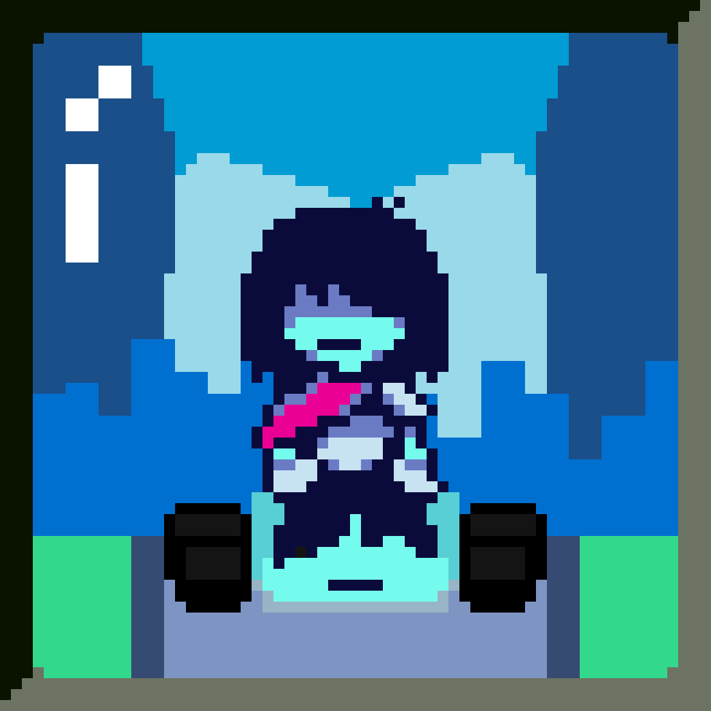
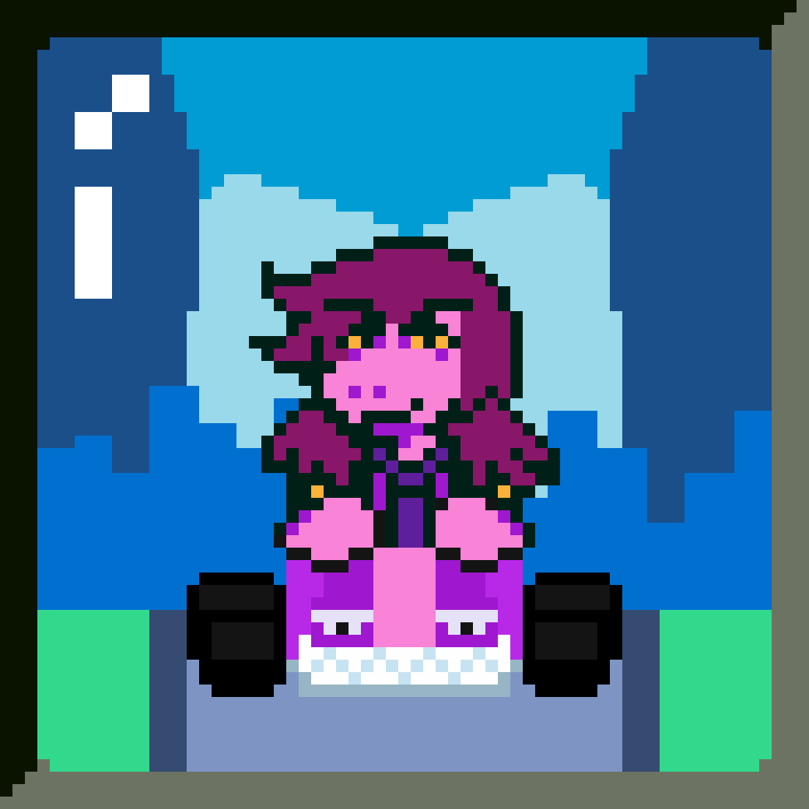
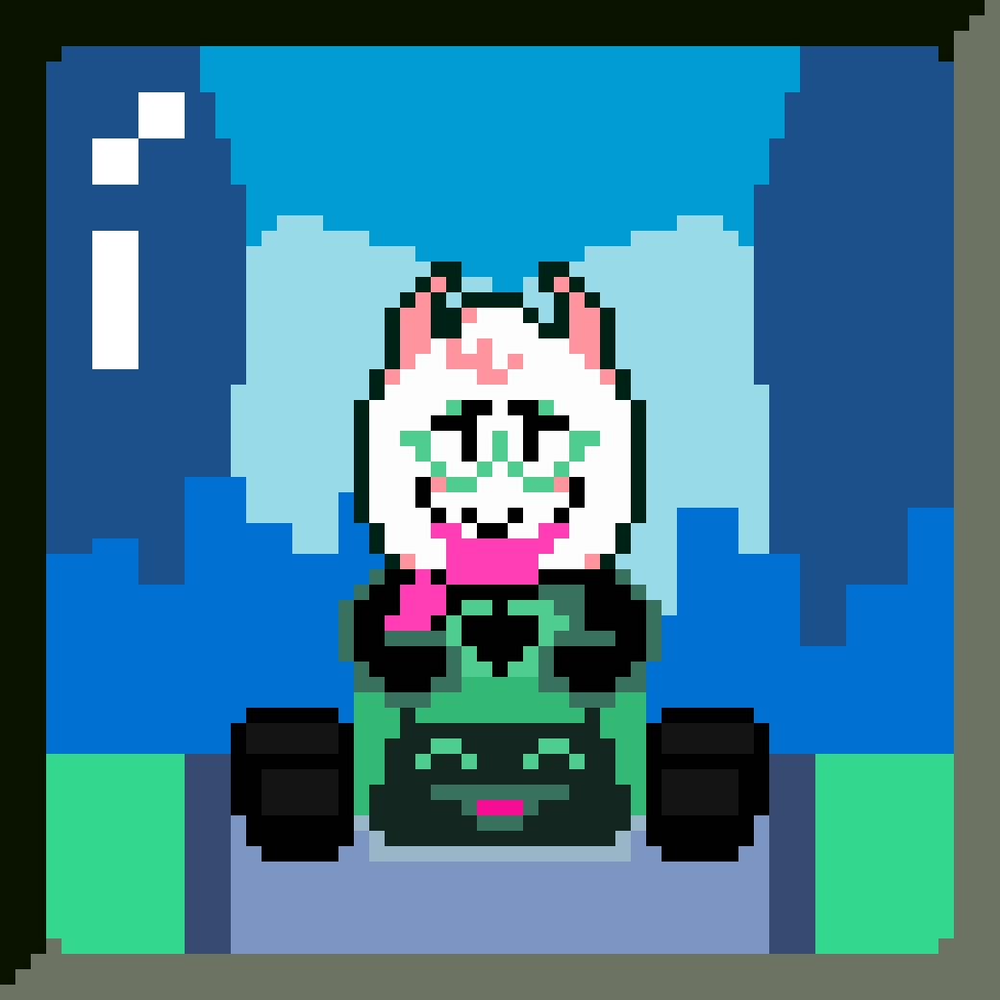
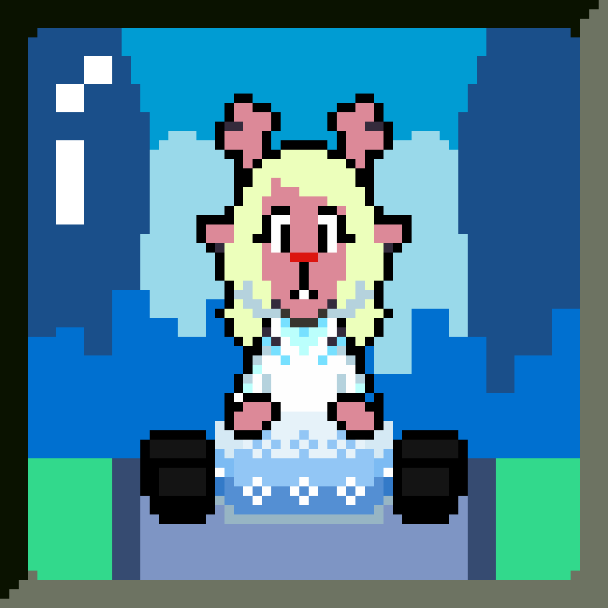
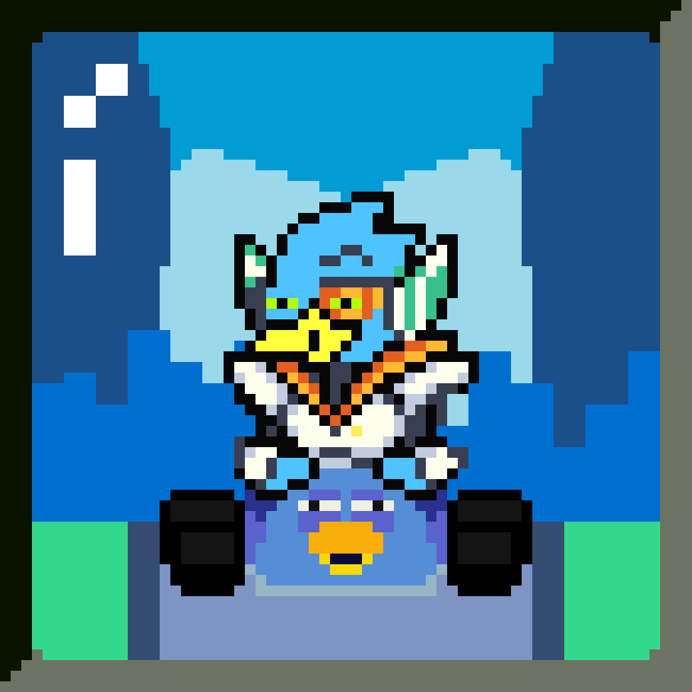

# Entrega de projeto - Simulador de Corridas do Deltarune Kart com Node.js | DIO

Neste projeto, foi desenvolvida uma corrida que considera as habilidades dos personagens e as variáveis das pistas. O desenvolvimento foi realizado utilizando NodeJS.

<b>Objetivo:</b>
                
<p>Mario Kart é uma série de jogos de corrida desenvolvida e publicada pela Nintendo. Nosso desafio será criar uma lógica de um jogo de vídeo game para simular corridas de Mario Kart, levando em consideração as regras e mecânicas abaixo.</p>

<table style="border-collapse: collapse; width: 800px; margin: 0 auto;">
    <tr>
        <td style="border: 1px solid black; text-align: center; width: 200px">
            <p>KRIS</p>
            
        </td>
        <td style="border: 1px solid black; text-align: center;">
            <p style="margin: 5px">Lutar: 2</p>
            <p style="margin: 5px">Agir: 3</p>
            <p style="margin: 5px">Sorte: 1</p>
            <p style="margin: 5px">Salvar: 4</p>
            <p style="margin: 5px">Defender: 0</p>
        </td>
    </tr>
    <tr>
        <td style="border: 1px solid black; text-align: center; width: 200px">
            <p>SUSIE</p>
            
        </td>
        <td style="border: 1px solid black; text-align: center;">
            <p style="margin: 5px">Lutar: 4</p>
            <p style="margin: 5px">Agir: 1</p>
            <p style="margin: 5px">Sorte: 2</p>
            <p style="margin: 5px">Salvar: 0</p>
            <p style="margin: 5px">Defender: 3</p>
        </td>
    </tr>
    <tr>
        <td style="border: 1px solid black; text-align: center; width: 200px">
            <p>RALSEI</p>
            
        </td>
        <td style="border: 1px solid black; text-align: center;">
            <p style="margin: 5px">Lutar: 0</p>
            <p style="margin: 5px">Agir: 2</p>
            <p style="margin: 5px">Sorte: 1</p>
            <p style="margin: 5px">Salvar: 3</p>
            <p style="margin: 5px">Defender: 4</p>
        </td>
    </tr>
    <tr>
        <td style="border: 1px solid black; text-align: center; width: 200px">
            <p>NOELLE</p>
            
        </td>
        <td style="border: 1px solid black; text-align: center;">
            <p style="margin: 5px">Lutar: 1</p>
            <p style="margin: 5px">Agir: 4</p>
            <p style="margin: 5px">Sorte: 0</p>
            <p style="margin: 5px">Salvar: 2</p>
            <p style="margin: 5px">Defender: 3</p>
        </td>
    </tr>
    <tr>
        <td style="border: 1px solid black; text-align: center; width: 200px">
            <p>BARDLY</p>
            
        </td>
        <td style="border: 1px solid black; text-align: center;">
            <p style="margin: 5px">Lutar: 3</p>
            <p style="margin: 5px">Agir: 2</p>
            <p style="margin: 5px">Sorte: 4</p>
            <p style="margin: 5px">Salvar: 1</p>
            <p style="margin: 5px">Defender: 0</p>
        </td>
    </tr>
</table>

<h3>🕹️ Regras & mecânicas:</h3>

<b>Jogadores:</b>

<label for="jogadores-item">O Computador deve receber dois personagens para disputar a corrida em um objeto cada</label>

<b>Pistas:</b>

<ul>
    <li>
        <label for="pistas-1-item">Os personagens irão correr dando 3 voltas com 6 blocos de pistas</label>
    </li>
    <li>
        <label for="pistas-2-item">A cada bloco de pista é sortiada aleatoriamente previamente para montar a volta</label>
    </li>
    <li>
        <label for="pistas-3-item">A cada bloco poderá sortear uma tipo de pista, sendo ela: uma reta, uma curva, um confronto e uma up_box</label>
        <ul>
            <li>
                <label for="pistas-3-1-item">Caso a pista seja uma RETA:
                <br>
                O jogador deve jogar um dado de 6 lados e somar o atributo AGIR, o jogador que tiver a pontuação mais alta ganha um ponto</label>
            </li>
            <li>
                <label for="pistas-3-2-item">Caso a pista seja uma CURVA:
                <br>
                O jogador deve jogar um dado de 6 lados e somar o atributo SALVAR, o jogador que ultrapassar de 5 ganha um ponto</label>
            </li>
            <li>
                <label for="pistas-3-3-item">Caso a pista seja uma CONFRONTO:
                <br>
                O jogador que estiver ficando pra traz, vai atacar o jogador que estiver na frente, ambos joga um dado de 6 lados somandos com atributos:</label>
                <ul>
                    <li>
                        <label for="pistas-3-3-1-item">
                        quem vai atacar usa o atributo LUTAR</label>
                    </li>
                    <li>
                        <label for="pistas-3-3-2-item">
                        quem vai ser atacado usa o atributo DEFENDER</label>
                    </li>
                </ul>
            </li>
            <li>
                <label for="pistas-3-4-item">Caso a pista seja uma UP_BOX:
                <br>
                Será sortiado para saber se o jogador conseguiu pegar o item ou não, caso o jogador tenha conseguido o item, o jogador deve jogar um dado de 6 lados e somar o atributo SALVAR:</label>
                <ul>
                    <li>
                        <label for="pistas-3-4-1-item">
                        1-2 "coletou Ovo": Nada acontece</label>
                    </li>
                    <li>
                        <label for="pistas-3-4-2-item">
                        3-4 "coletou Cauda de Javil": Você ganha 1 ponto de atributo em LUTA e DEFESA</label>
                    </li>
                    <li>
                        <label for="pistas-3-4-3-item">
                        5-6 "coletou Negociador": Você rouba 1 ponto de seu adversario</label>
                    </li>
                    <li>
                        <label for="pistas-3-4-4-item">
                        7-8 "coletou Machado da Justiça": Seu adversario perde 1 ponto</label>
                    </li>
                    <li>
                        <label for="pistas-3-4-5-item">
                        9-10 "coletou Cristal de Sombra": Você ganha 1 ponto</label>
                    </li>
                </ul>
            </li>
        </ul>
    </li>
</ul>

<b>Condição de vitória:</b>

<label for="vitoria-item">Ao final, vence quem acumulou mais pontos</label>

## Tecnologias Utilizadas

- JavaScript.
- NodeJs.

## Como Executar o Projeto

1. Clone o repositório:

   ```bash
   git clone https://github.com/fabiocasadossites/desafio-nodejs-mariokart-dio.git
   ```

2. Navegue até o diretório do projeto:

   ```bash
   cd nome-do-repositorio
   ```

3. Em seu terminal e na pasta do projeto

   ```bash
   node src/index.js
   ```
